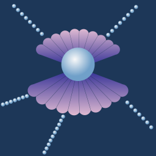

<p align="center">
  
</p>

# Pearlnode

A local-only Android app for controlling Shelly smart home devices. No cloud account or internet required.

## Features

- **Device discovery:** mDNS/DNS-SD auto-scan, IP range subnet scan, and BLE scan for devices in setup mode
- **Add by IP:** manual entry for devices not discoverable on the network
- **Gen1/Gen2/Gen3/Gen4 auto-detection:** probes `/shelly` and routes to the correct API
- **Secure credential storage:** username/password encrypted with AES-256-GCM via Android Keystore, never leaves the device
- **Per-channel on/off control** with live status polling
- **Power monitoring:** real-time wattage (Plug S, Plug M, devices with `apower`)
- **RGBW control:** per-device color picker and brightness slider
- **Dimmer control:** brightness slider for Gen1/Gen2 dimmers
- **Pulse / door trigger:** configurable relay pulse for gate openers and door locks
- **Schedules:** create, edit, toggle, and delete device schedules; cron-based, supports day-of-week repeat
- **Alarm Sync:** automatically creates device schedules relative to phone alarm times (configurable offset, action, and channel); auto-updates on alarm change via WorkManager
- **Firmware updates:** checks `updates.shelly.cloud`, downloads, and uploads directly to the device (stable + beta channels)
- **Home screen widgets:** multi-device widget and per-device toggle widget
- **9 languages:** English, German, Czech, Slovak, Polish, French, Italian, Spanish, Dutch

## Supported devices

### Gen 1

| Model | Capability |
|---|---|
| Shelly 1, 1L, 1PM | Relay |
| Shelly 2, 2.5 | 2-channel relay |
| Shelly 4Pro | 4-channel relay |
| Shelly UNI | Relay |
| Shelly i3 | 3-input sensor |
| Shelly Plug (EU/US), Plug S | Plug with power monitoring |
| Shelly Dimmer, Dimmer 2, Duo, Vintage | Dimmer |
| Shelly Bulb, RGBW2 | RGBW |
| Shelly EM, 3EM | Energy monitor |
| Shelly H&T, Flood, Door/Window 2, Motion | Sensor |

### Gen 2 / Gen 3 / Gen 4

| Model family | Capability |
|---|---|
| Plus 1, 1 Mini, 1PM, 1PM Mini, 2PM, 4PM | Relay |
| Plus Plug S/M | Plug with power monitoring |
| Plus Dimmer, Dimmer 10V, Wall Dimmer | Dimmer |
| Plus RGBW PM | RGBW |
| Plus i4, H&T, Flood, EM Mini | Sensor |
| Pro 1, 1PM, 2, 2PM, 3, 4PM | Relay |
| Pro EM, 3EM | Energy monitor |
| Pro Dimmer 1PM/2PM | Dimmer |
| Pro RGBW PM | RGBW |
| Wall Display | Relay |
| Gen3 and Gen4 equivalents of the above | — |

## Building

### Requirements

- Android Studio (latest stable)
- Android SDK API 36 (compile) / API 35 (target)
- Android 8.0+ device or emulator (API 26+)

### Steps

1. Clone the repo
2. Open the project folder in Android Studio
3. Let Gradle sync and download dependencies (first run needs internet)
4. Connect your phone via USB or [wireless debugging](https://developer.android.com/tools/adb#wireless-adb-android-11)
5. Press **Run ▶** (`Shift+F10`)

`local.properties` is auto-created by Android Studio and is gitignored.

## Adding a device

1. Tap **+** on the main screen
2. Tap **Scan** to auto-discover devices on your local network, or enter an IP address directly
3. Give the device a name and select its type (or tap 🔍 to auto-fill from the device)
4. Optionally enter credentials if authentication is enabled on the device
5. Tap **Add device**; the app connects and stores the generation (Gen1/Gen2) for future calls

## Architecture overview

```
app/src/main/java/com/pearlnode/
├── PearlnodeApp.kt           # Application: lazy singletons
├── MainActivity.kt
├── model/                    # Pure data: Device, DeviceState, Schedule, FirmwareInfo
├── data/
│   ├── api/                  # Gen1Client (REST), Gen2Client (JSON-RPC), ShellyClientFactory
│   ├── db/                   # Room database + DeviceDao
│   ├── discovery/            # mDNS, subnet scan, BLE, DeviceTypeDetector
│   ├── DeviceRepository.kt   # Coroutine-safe facade over api/ + db/
│   └── FirmwareRepository.kt # Firmware check & download (updates.shelly.cloud)
├── security/
│   └── CredentialStore.kt    # EncryptedSharedPreferences (AES-256)
├── alarmSync/                # Alarm Sync feature
│   ├── AlarmSyncConfig.kt    # Config data class + SharedPreferences store
│   ├── AlarmSyncRepository.kt# Alarm reading + schedule diff + performSync()
│   ├── AlarmSyncWorker.kt    # WorkManager CoroutineWorker (periodic 4h + one-shot)
│   └── AlarmChangeReceiver.kt# BroadcastReceiver → enqueues one-shot worker
└── ui/
    ├── screens/              # Compose screens: DeviceList, DeviceControl, AddEditDevice
    ├── viewmodels/           # DeviceControlViewModel, DeviceListViewModel, AddEditDeviceViewModel
    ├── widget/               # Glance home screen widgets
    ├── theme/                # Material 3 light/dark theme
    └── AppNavHost.kt         # Navigation graph
```

**Key libraries:** Jetpack Compose + Material 3 · Room · OkHttp 5 · kotlinx-serialization-json · Kotlin coroutines + StateFlow · WorkManager · AndroidX Security Crypto · Glance (widgets)

## Shelly API notes

| | Gen1 | Gen2 / Gen3 / Gen4 |
|---|---|---|
| Detection | `/shelly`: no `gen` field, or `"gen": 1` | `/shelly`: `"gen": 2` (or 3/4) |
| Switch on/off | `POST /relay/{ch}` form body `turn=on` | `POST /rpc` → `Switch.Set {id, on}` |
| RGBW | `POST /light/0` form body | `POST /rpc` → `Light.Set` |
| Dimmer | `POST /light/0?brightness=N` | `POST /rpc` → `Light.Set {brightness}` |
| Pulse | `POST /relay/{ch}?timer=N` | `POST /rpc` → `Switch.Set {toggle_after}` |
| Schedule list | `GET /settings/schedules` → `{jobs:[...]}` | `POST /rpc` → `Schedule.List` → `{jobs:[...]}` |
| Schedule create | `POST /settings/add_schedule` → `{jobs:[...]}` (no top-level id) | `POST /rpc` → `Schedule.Create` → `{id}` |
| Auth | HTTP Basic or Digest/MD5 | SHA-256 Digest |
| Firmware upload | `POST /ota` multipart | `Shelly.Update {url}` (device pulls from local HTTP server) |

All communication is over HTTP on the local network. No data leaves your device.

## License

[MIT](LICENSE), © 2026 Vanda Hendrychová